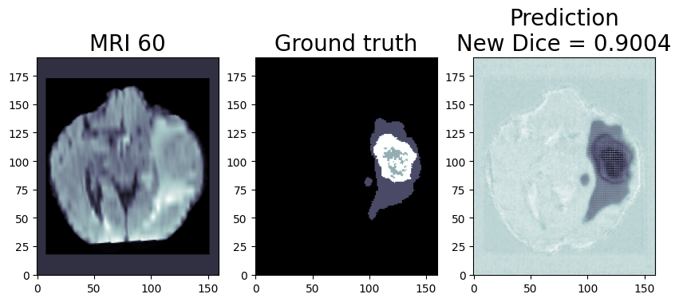

# Inference
This document contains instructions on how to perform optimization and inference using OpenVINO™ toolkit.
## Project Structure 
```
├── onnx-to-ir-optimization - Parent helm chart     
    ├── Chart.yaml - Contains metadata about the helm chart itself.
    ├── downloader.py - Downloads the dataset and sets it up for usage.
    ├── install_aws_cli.sh - Installs the pre-requisite packages for running downloader.py
    ├── onnx_model - Location to host the trained FP32 ONNX model.
    ├── reports - Location to host the benchmark_app output dumps.
        ├── FP32_Reports - Location where benchmark_app outputs are dumped w.r.t FP32 model.
        ├── INT8_Reports - Location where benchmark_app outputs are dumped w.r.t INT8 model.
    ├── templates - Holds all the configurations of the application to be deployed into the cluster.
        ├── _helpers.tpl
        ├── mo-optimizer-pod.yaml
    ├── charts - Holds different helm configurations for various type of deployments.
    ├── data_source - Contains the dataset directory files and sample output predictions.
        ├── Task01_BrainTumour
            ├── imagesTr - Training data.
            ├── labelsTr - Labels for the training data.
            ├── imagesTs - Test data.
            ├── dataset.json - Contains information about the model dataset.
    ├── images - images to be displayed in the README.md file.
    ├── ir_model - Location to host the FP32 and INT8 OpenVINO™ IR models.
        ├── FP32 - Location where FP32 IR model is stored.
        ├── INT8 - Location where INT8 IR model is stored.
    ├── README.md - Documentation for Inference section.
    ├── scripts - OpenVINO™ optimization and inference scripts.
        ├── dataloader.py - Script that loads the dataset.
        ├── download_onnx.sh - Downloads the ONNX model from the Amazon S3 bucket.
        ├── inference.py - Script for sample inference using OpenVINO™ API's.
        ├── pot_unet2d_quantize.py - Script to quantize the model from FP32 to INT8.
        ├── preprocess.py - Script to pre-process the data for inference.
        ├── run.sh - Script that automates the run for quantization and the sample inference.
    ├── values.yaml - Contains configuration settings for the chart.
```

## Option 1: Running Optimization and Inference using docker containers.

### Connect to any Ubuntu (Linux) CPU instance.
1. You can connect to any local instance or cloud (AWS) instance which has  Intel® CPU. <br />
Refer [Development Platforms](https://www.intel.com/content/www/us/en/developer/tools/openvino-toolkit/system-requirements.html) to know more about the target system platforms OpenVINO™ supports today. <br />

We have tested it on AWS EC2 M6i instance (The latest generation  Intel® Xeon Scalable processors (code-named Ice Lake)). <br />
**Refer:** [AWS EC2 M6i instance](https://aws.amazon.com/ec2/instance-types/m6i/)

### docker pull the OpenVINO™ dev image from dockerhub.

**Docker:**  Make sure the Docker is installed and available on your system. (Steps to Install [click here](https://docs.docker.com/engine/install/ubuntu/ "Docker Engine Installation"))

1. docker pull:
```bash
sudo docker pull openvino/ubuntu20_dev:2022.2.0
```
**Note:** We are using the official OpenVINO™ docker image(https://hub.docker.com/r/openvino/ubuntu20_dev) from dockerhub.

2. Tag the pulled docker image and tag it as 'optimization_container':
```
sudo docker tag openvino/ubuntu20_dev:2022.2.0 optimization_container
```

### Get the repository ready.

1. Clone the habana-training-ov-inference repository:
```bash
git clone https://github.com/intel/cv-training-and-inference-openvino.git
```
2. Navigate to onnx-to-ir-optimization directory:
```bash
cd cv-training-and-inference-openvino/gaudi-segmentation-unet-ptq/inference/onnx-to-ir-optimization
```

### Download the BraTS 2017 BrainTumor Dataset:

1. Install the prerequisite:
```bash
./install_aws_cli.sh
```
Installs the latest version of the AWS CLI for Linux which is required to execute the below downloader.py script which downloads the dataset. [Refer](https://docs.aws.amazon.com/cli/latest/userguide/getting-started-install.html) <br />

2. Download the dataset: 
```bash
python3 downloader.py
```
**NOTE:** 
The script downloads the dataset in `./data_source/` directory by default. The downloaded dataset is the 'Task01_BrainTumour.tar" from [Medical Decathlon](http://medicaldecathlon.com/).<br />

### OpenVINO's Model Optimizer(MO), benchmark_app and sample inference.

#### Use OpenVINO's Model Optimizer(MO) to convert the trained ONNX FP32 model to OpenVINO'S FP32 Intermediate Representation(IR) format:
Firstly, make sure to update the `./onnx-to-ir-optimization/onnx_model/` directory with the onnx model that was generated as part of the model training process. In case your model is stored in Amazon S3 bucket(using `upload_onnx.sh` script of `./training/scripts/` directory), you can make use of the `download_onnx.sh` script availble in `./onnx-to-ir-optimization/scripts/` directory to download it.
```bash
./onnx-to-ir-optimization/download_onnx.sh <bucket_name> <zip_file_name> onnx_model
```  
Above command will download and unzip `<zip_file_name>` file from `<bucket_name>/models/` path of your Amazon S3 bucket to `./onnx-to-ir-optimization/onnx_model/` directory.

```bash
sudo docker run -u root -v "$(pwd)"/onnx_model:/home/Optimization/onnx_model:rw -v "$(pwd)"/ir_model:/home/Optimization/ir_model:rw optimization_container mo --input_model /home/Optimization/onnx_model/unet2d.onnx --input_shape [1,4,192,160] --data_type FP32 --output_dir /home/Optimization/ir_model/FP32
```
**NOTES:** <br />
a. The Model Optimizer output is a FP32 IR model with input shape [1,4,192,160] in the order [N,C,H,W] and it is stored at './ir_model/FP32/' <br />
b. Read more about Model Optimizer tool here: [Model Optimizer](https://docs.openvino.ai/latest/openvino_docs_MO_DG_Deep_Learning_Model_Optimizer_DevGuide.html) <br /> <br />


#### Using the benchmark_app tool from OpenVINO™ Toolkit to measure the performance of the FP32 IR model:
```bash
sudo docker run -u root -v "$(pwd)"/ir_model:/home/Optimization/ir_model:rw -v "$(pwd)"/reports:/home/Optimization/reports:rw optimization_container benchmark_app -hint throughput -d CPU -m /home/Optimization/ir_model/FP32/unet2d.xml -report_type no_counters -report_folder /home/Optimization/reports/FP32_Reports -dump_config /home/Optimization/reports/FP32_Reports/benchmark_parameters.json
```
**NOTES:** <br />
a. The output of benchmarking the model can be seen on the screen as it happens. benchmark_app helps to measure the performance of the model using OpenVINO™ Toolkit and shows many useful metrics like throughput and latency of the model. <br />
b. The above command also dumps two additional output files. <br /> <br />
```
 ├── reports/FP32_Reports - FP32 IR model dumps are dumped here.
    ├── benchmark_parameters.json - Configuration options used while benchmarking the model.
    ├── benchmark_report.csv - benchmarking results are captured here.
```
c. Read more about benchmark_app tool and it's configuration options here: [benchmark_app](https://docs.openvino.ai/latest/openvino_inference_engine_tools_benchmark_tool_README.html) <br />

#### Sample Inference with FP32 IR model using OpenVINO™ Sync API's:
```bash
sudo docker run -u root -v "$(pwd)"/ir_model:/home/Optimization/ir_model -v "$(pwd)"/data_source:/home/Optimization/data_source -v "$(pwd)"/scripts:/home/Optimization/scripts --env OPTIMIZATION=false --env PRECISION="FP32" optimization_container /home/Optimization/scripts/run.sh
```
The predicted output is stored as `prediction_fp32.png` at `./data_source/` directory. <br />
* The predicted image has following three sections. <br />
```
    ├── MRI Image - This is the original MRI image being tested.
    ├── Ground truth - The true and accurate segmentation of the test image.
    ├── Prediction - The predicted segmentation with it's dice score.
```
* Dice score metric: Dice score is a measure of how similar the objects are. So it is the size of the overlap of the two segmentations divided by the total size of the two objects. <br />

**NOTE:** Read more about OpenVINO™ Inference Engine tool and all of it's configuration options here: <br />
a. [Integrate OpenVINO™ with Your Application](https://docs.openvino.ai/latest/openvino_docs_OV_UG_Integrate_OV_with_your_application.html) <br />
b. [OpenVINO™ Sample Notebooks](https://github.com/openvinotoolkit/openvino_notebooks/tree/main/notebooks) <br />

**FP32 Sample Output prediction:** <br />
 <br />
**NOTE:** The FP32 prediction shown here is from a test image from training dataset which was never used for training. The prediction is from a trained model which was trained for 8 epochs with 8 HPU multi card training on Amazon EC2 DL1 Instance with 400/484 images from training folder. <br />

## Quantization (Recommended to use if you need better performance of the model)
Quantization is the process of converting a Deep Learning model’s weights to a lower precision such that it needs less computation. This inherently leads to a jump in the model’s performance, in terms of its processing speed and throughput, for you get a higher throughput(FPS) when dealing with video streams.
### Use OpenVINO's Post Training Quantization Tool (POT), benchmark_app and sample inference.

#### Using OpenVINO™ POT Default Quantization Algorithm to quantize the FP32 IR model into INT8 IR model:
```bash
sudo docker run -u root -v "$(pwd)"/ir_model:/home/Optimization/ir_model -v "$(pwd)"/data_source:/home/Optimization/data_source -v "$(pwd)"/scripts:/home/Optimization/scripts --env OPTIMIZATION=true optimization_container /home/Optimization/scripts/run.sh
```
**NOTES:** <br />
a. This quantization process might take upto 5 minutes depending on the CPU being used when a callibration dataset of 300 samples is used. You can modify the 'stat_subset_size' to fewer samples in the `pot_unet2d_quantize.py` file for faster quantization process. <br />
b. The output of POT is a INT8 IR model with input shape [1,4,192,160] in the order [N,C,H,W] and it is stored at './ir_model/INT8/' <br />
c. This AI Workflow has used POT Compression API to perform quantization [POT Compression API](https://docs.openvino.ai/latest/notebooks/111-detection-quantization-with-output.html) <br />
c. The workflow demonstartes usage of DefaultQuantization Algorithm [DefaultQuantization Algorithm](https://docs.openvino.ai/latest/pot_compression_algorithms_quantization_default_README.html) <br />
d. Use Quantization Best Practices [Quantization best practices](https://docs.openvino.ai/latest/pot_docs_BestPractices.html) <br />
e. There is another option for using POT using command-line interface (CLI). This option is not demonstarted using this workflow but can be easily explored [Use POT CLI](https://docs.openvino.ai/latest/pot_compression_cli_README.html) <br />
f. This workflow demonstartes using Default Quantization for the model. In case when it introduces a significant accuracy degradation, the Accuracy-aware Quantization algorithm can be used to remain accuracy within the pre-defined range [Quantizing Model with Accuracy Control](https://docs.openvino.ai/latest/pot_accuracyaware_usage.html) <br /> <br />


#### Using the benchmark_app tool from OpenVINO™ Toolkit ro measure the performance of the INT8 IR model:
```bash
sudo docker run -u root -v "$(pwd)"/ir_model:/home/Optimization/ir_model:rw -v "$(pwd)"/reports:/home/Optimization/reports:rw optimization_container benchmark_app -hint throughput -d CPU -m /home/Optimization/ir_model/INT8/unet2d_int8.xml -report_type no_counters -report_folder /home/Optimization/reports/INT8_Reports -dump_config /home/Optimization/reports/INT8_Reports/benchmark_parameters.json
```
**NOTES:** <br />
a. The output of benchmarking of the model can be seen on the screen as it happens. benchmark_app helps measure the performance of the model using OpenVINO™ Toolkit and shows many useful metrics like Throughput and Latency of the model. <br />
b. The above command also dumps two additional output files.
```
 ├── reports/INT8_Reports - INT8 IR model dumps are dumped here.
    ├── benchmark_parameters.json - Configuration options used while benchmarking the model.
    ├── benchmark_report.csv - benchmarking results are captured here.
```
c. Read more about benchmark_app tool and all of it's configuration options here: [benchmark_app](https://docs.openvino.ai/latest/openvino_inference_engine_tools_benchmark_tool_README.html) <br />  <br />

#### Sample Inference with INT8 IR model using OpenVINO™ API's:
```bash
sudo docker run -u root -v "$(pwd)"/ir_model:/home/Optimization/ir_model -v "$(pwd)"/data_source:/home/Optimization/data_source -v "$(pwd)"/scripts:/home/Optimization/scripts --env OPTIMIZATION=false --env PRECISION="INT8" optimization_container /home/Optimization/scripts/run.sh
```
* The predicted output is stored as `prediction_int8.png` at `./data_source/` directory. <br />
* The predicted image has following three sections. <br />
```
    ├── MRI Image - This is the original MRI image being tested.
    ├── Ground truth - The true and accurate segmentation of the test image.
    ├── Prediction - The predicted segmentation with it's dice score.
```
* Dice score metric: Dice score is a measure of how similar the objects are. So it is the size of the overlap of the two segmentations divided by the total size of the two objects. <br />

**NOTE:** Read more about OpenVINO™ Inference Engine tool and all of it's configuration options here: <br />
a. [Integrate OpenVINO™ with Your Application](https://docs.openvino.ai/latest/openvino_docs_OV_UG_Integrate_OV_with_your_application.html) <br />
b. [OpenVINO™ Sample Notebooks](https://github.com/openvinotoolkit/openvino_notebooks/tree/main/notebooks) <br />

**INT8 Sample Output prediction:** <br />
 <br />
**NOTE:** The INT8 prediction shown here is from a test image from training dataset which was never used for training. The prediction is from a quantized model which we quantized using POT with a callibration dataset of 300 samples from the dataset. <br />


## Option 2: Running Optimization and Inference with Helm Chart using Kubernetes.
This section of the document will guide you to deploy the application to a **K3S cluster** with **helm chart** to perform Optimization, Post-Training Optimization, Benchmark and Inference over models with different precision.

The directory `onnx-to-ir-optimization/` from this repository is a helm chart and has several sub-charts as dependency to deploy the application to a kubernetes cluster. Both parent chart and sub-chart can be run individually and also combinedly.

### Prerequisites:
Following are the rerequisites to deploy the helm chart.

#### 1. Device configuration for the cluster:
One node Kubernetes cluster that has comparable configurations as follows:

| **Name**:                | **Description**
| :---                              | :---
| OS                                | Ubuntu 20.04
| CPU                               | Intel(R) Xeon(R) Platinum 8375C CPU @ 2.90GHz (8 vCPUs)
| Usable RAM                        | 32 GB
| Disk Size                         | 50 GB

#### 2. Installation:  

1. **Docker:**  Make sure Docker is installed and available on your system. (Steps to Install [click here](https://docs.docker.com/engine/install/ubuntu/ "Docker Engine Installation"))

2. **K3S:** 
    Any flavor of kuberentes variations. <br />

    We have used rancher k3s installation. Further details in [here](https://rancher.com/docs/k3s/latest/en/installation/install-options/#options-for-installation-with-script) <br />

    To install K3S, run the commands below.
    ```bash
    curl -sfL https://get.k3s.io | sh -s - --write-kubeconfig-mode 644
    ```

    Setting the environment variable for KUBECONFIG.
    ```bash
    export KUBECONFIG=/etc/rancher/k3s/k3s.yaml
    ```
3. **Helm:**
    Helm installation on master node. <br />

    To install the Helm run the below commands. Incase of any issues refer to [here](https://helm.sh/docs/intro/install/) <br />
    ```bash
    curl -fsSL -o get_helm.sh https://raw.githubusercontent.com/helm/helm/main/scripts/get-helm-3
    ```
    ```bash
    chmod 700 get_helm.sh
    ```
    ```bash
    ./get_helm.sh
    ```

#### 3. Dataset Preparation:

Follow the **"Download the BraTS 2017 BrainTumor Dataset"** section of this page to download the dataset. [click here](#download-the-brats-2017-braintumor-dataset)

#### 4. Pull Image:

Follow the **"docker pull the OpenVINO™ dev image from dockerhub"** section of this page to pull the required OpenVINO™ dev image. [click here](https://github.com/intel/cv-training-and-inference-openvino/blob/main/gaudi-segmentation-unet-ptq/inference/onnx-to-ir-optimization#docker-pull-the-openvino-dev-image-from-dockerhub)

**Note:** Additional step of tagging the pulled docker image is not required, as we are directly configuring the pulled image name in our helm charts.

#### 5. Update the 'values.yaml' file:

Update the `<absolute-path-of-chart-directory>` field under mountpath: of 'values.yaml' file present in `onnx-to-ir-optimization/`, `onnx-to-ir-optimization/charts/performance-benchmark/`, `onnx-to-ir-optimization/charts/post-optimization/`, and `onnx-to-ir-optimization/charts/sample-inference/` directories, with the absolute path to the `onnx-to-ir-optimization/` directory. Note that, relative paths do not work with helm.

### Deploy the Chart:
This step will deploy the chart to the k3S cluster. In the upcoming steps, we will deploy the same chart multiple times in different way to perform different action. For more details on helm commands refer [here](https://helm.sh/docs/helm/helm_install/) <br />

**Step 1:** Deploy the chart to Perform 'ONNX Model to FP32 IR Model Conversation' and 'FP32 IR Model to INT8 IR Model using Post-training Optmization'.
Run the commands below from the `./onnx-to-ir-optimization/` directory.

1.  Before running the command make sure to update the `./onnx-to-ir-optimization/onnx_model/` directory with the onnx model that was generated as part of the model training process. In case your model is stored in Amazon S3 bucket(using `upload_onnx.sh` script of `./training/scripts/` directory), you can make use of the `download_onnx.sh` script availble in `./onnx-to-ir-optimization/scripts/` directory to download it.

    ```bash
    ./onnx-to-ir-optimization/scripts/download_onnx.sh <bucket_name> <zip_file_name> onnx_model
    ```  
    Above command will download and unzip `<zip_file_name>` file from `<bucket_name>/models/` path of your Amazon S3 bucket to `./onnx-to-ir-optimization/onnx_model/` directory.

2.  Now Install the Chart

    ```bash
    helm install release-name-1 --set performance-benchmark.enabled=false --set sample-inference.enabled=false --set post-optimization.enabled=true .
    ```
    This will deploy two different pods to the k3s cluster. The status of each pod can be checked using `kubectl get pods` command. Upon successful completion, the status of both the pods will be changed to 'completed'.
    [click here for ONNX FP32-FP32 IR output info](https://github.com/intel/cv-training-and-inference-openvino/blob/main/gaudi-segmentation-unet-ptq/inference/onnx-to-ir-optimization#use-openvinos-model-optimizermo-to-convert-the-trained-onnx-fp32-model-to-openvinos-fp32-intermediate-representationir-format)
    
    [click here for FP32 IR-INT8 IR output info](https://github.com/intel/cv-training-and-inference-openvino/blob/main/gaudi-segmentation-unet-ptq/inference/onnx-to-ir-optimization#using-openvino-pot-default-quantization-algorithm-to-quantize-the-fp32-ir-model-into-int8-ir-model)

**Step 2:** FP32 IR Model files are now available from the above step, we can now deploy one of the sub-charts to get inference numbers using a U-Net 2D sample.
```bash
helm install release-name-2  --set env.PRECISION=FP32 ./charts/sample-inference/
```

Here we are deploying an individual sub-chart of parent chart to perform inference with the FP32 model.
This will deploy a single pod to the k3s cluster.
[click here for output info](https://github.com/intel/cv-training-and-inference-openvino/blob/main/gaudi-segmentation-unet-ptq/inference/onnx-to-ir-optimization#sample-inference-with-fp32-ir-model-using-openvino-sync-apis)

**Step 3:** Now deploy a different sub-chart to perform the Benchmark with the FP32 IR Model.
1.  Before that, make sure to update the following contents to values.yaml file present in `onnx-to-ir-optimization/charts/performance-benchmark/` directory.

    ```bash
    arguments:
    modelPath: '/home/Optimization/ir_Model/FP32/unet2d.xml'
    reportPath: '/home/Optimization/reports/FP32_Reports'
    configPath: '/home/Optimization/reports/FP32_Reports/benchmark_parameters.json'
    ```
2. Now deploy the chart with below command.

    ```bash
    helm install release-name-3 ./charts/performance-benchmark/
    ````
    This will again deploy a single pod to the k3s cluster.

**Step 4:** This step is similar to second step. Only difference is the model precision. As INT8 IR files got generated from our first deployment. So here, we can deploy the same sub-chart used in second step with INT8 precision to get INT8 inference numbers using a U-Net 2D sample.

```bash
helm install release-name-4  --set env.PRECISION=INT8 ./charts/sample-inference/
```

This will again deploy a single pod to the k3s cluster similar to second step.

[click here for output info](https://github.com/intel/cv-training-and-inference-openvino/blob/main/gaudi-segmentation-unet-ptq/inference/onnx-to-ir-optimization#sample-inference-with-int8-ir-model-using-openvino-apis)

**Step 5:** Similar to third step, here we will deploy the same sub-chart used in third step to perform INT8 Benchmark.
1.  Make sure to update the following contents to values.yaml file present in `onnx-to-ir-optimization/charts/performance-benchmark/` directory.

    ```bash
    arguments:
    modelPath: '/home/Optimization/ir_Model/INT8/unet2d_int8.xml'
    reportPath: '/home/Optimization/reports/INT8_Reports'
    configPath: '/home/Optimization/reports/INT8_Reports/benchmark_parameters.json'
    ```
2.  Now deploy the chart with the command below:

    ```bash
    helm install release-name-5 ./charts/performance-benchmark/
    ````

    This will again deploy a single pod to the k3s cluster similar to third step.

    [click here for output info](https://github.com/intel/cv-training-and-inference-openvino/blob/main/gaudi-segmentation-unet-ptq/inference/onnx-to-ir-optimization#using-the-benchmark_app-tool-from-openvino-toolkit-ro-measure-the-performance-of-the-int8-ir-model)

#### Summary:
The place holder `<release-name-n>` used in the above commands could be any string. It is required to create an instance of the chart. To list out all the instances from your charts run:
```bash
helm list
```
To list out all the pods deployed as part of your chart deployment run:
```bash
kubectl get pods
```
Observe that the status of all the pods are `Completed`. This will ensure that you have executed all the commands successfully.

To uninstall an instance of the deployed chart run, 
```
helm uninstall `<release-name-n>`
```
### **Troubleshoot:** 

1. Troubleshooting errors while helm installation:
    ```bash
    Error: INSTALLATION FAILED: Kubernetes cluster unreachable: Get "https://127.0.0.1:6443/version": x509: certificate signed by unknown authority
    ```
*  Solution 1:  
    ```bash
    export KUBECONFIG=/etc/rancher/k3s/k3s.yaml
    ```

*  Solution 2:  
    ```bash
    kubectl config view --raw > ~/.kube/config
    ```

2. To confirm if the pod has been deployed.
    ```
    kubectl get pods
    ```

-   If the STATUS of the pod is at "ContainerCreating" state then the pod is still being created.
    ```bash
    NAME               READY    STATUS              RESTARTS   AGE
    <pod_name>          0/1     ContainerCreating   0          20s
    ```

-   If the STATUS of the pod is at "Running" state then the pod is deployed and ready to execute.
    ```bash
    NAME              READY   STATUS    RESTARTS   AGE
    <pod_name>         0/1      Running   0          82s
    ```

-   If the STATUS of the pod is at "Completed" state then the pod is deployed and the job has been completely finished by the pod.
    ```bash
    NAME              READY   STATUS    RESTARTS   AGE
    <pod_name>         0/1      Completed   0          82s
    ```

3. To troubleshoot errors before pod status is running:
    ```bash
    kubectl describe pod <pod_name>
    ```
    Look at the logs to understand the issue and fix them.

4. To troubleshoot the errors after pod status is running:
    ```bash
    kubectl logs <pod_name>
    ```
    Currently `restartPolicy` of all our pods are configured to `onFailure`. So Pod will restart itself in case of any runtime error.
    The benefit is that the user doesn't have to re-deploy the same chart again after putting in the fixes, instead they can check the logs and make necessary changes like updating the missing data fields in the files, etc. The pod will pick the latest changes and will start running with the updated changes after the auto restart.

### Useful commands:

Uninstalling helm: (If required)
```
sudo rm -rf /usr/local/bin/helm
```

Uninstalling k3s: (If required)
```
/usr/local/bin/k3s-uninstall.sh
```
[Read more here](https://rancher.com/docs/k3s/latest/en/installation/uninstall/#:~:text=If%20you%20installed%20K3s%20using,installation%20script%20with%20different%20flags) <br />


### References
1. [OpenVINO™ blog](https://viso.ai/computer-vision/intel-openvino-toolkit-overview/) <br />
2. [POT Blog](https://learnopencv.com/post-training-quantization-with-openvino-toolkit/) <br />
3. [OpenVINO™ low-precision blog](https://community.intel.com/t5/Blogs/Tech-Innovation/Artificial-Intelligence-AI/Enhanced-low-precision-pipeline-to-accelerate-inference-with/post/1335626) <br />
4. [IntelAI/unet](https://github.com/IntelAI/unet/tree/master/2D)
