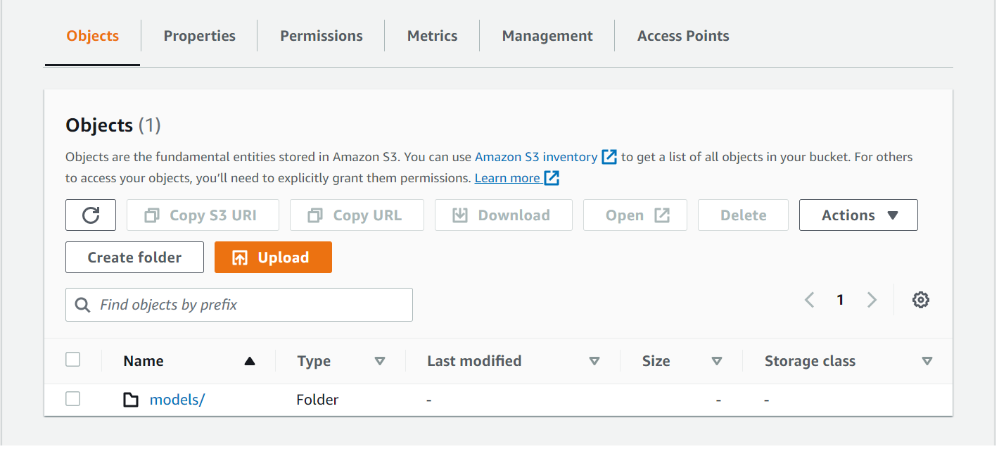

# Training
This document contains instructions on how to train a model using Habana® Gaudi® Processor on AWS*.

## Project Structure
```
./training/
├── Chart.yaml - Contains metadata about the Helm chart itself.
├── config/ - Folder for maintaining one or more configurations.
│   └── config.yaml - contains configurations like pipeline, preprocess, training, convert.
├── paths.sh - Used to define paths used during the training.
├── python/ - Folder for python scripts.
│   ├── cmd2yaml.py - helper script to generate yaml file by accepting cmd line input.
│   ├── get_output.py - script to convert the trained model to onnx/pt format.
│   └── run_config.py - executes the configurations defined in config file.
├── run_all.sh - end2end script which runs download to convert pipeline.
└── scripts/ - Folder for shell scripts.
│   ├── config_run.sh - script to run the configuration file.
│   ├── execute_container.sh - script to start the docker training_container.
│   ├── prepare_container.sh - script to prepare docker image with requirements preinstalled.
│   ├── requirements.sh - script to install prerequisites libraries needed for training.
│   └── upload_onnx.sh - script to upload the ONNX model output to S3 bucket (optional).
├── templates - Holds all the configurations of the application to be deployed into the cluster.
│   ├── _helpers.tpl
│   └── habana-training-pod.yaml
├── values.yaml - Contains configuration settings for the chart.
```

## Launch AWS EC2 instance
Click on [Launching/Connecting AWS Habana® instance](https://docs.habana.ai/en/latest/AWS_EC2_DL1_and_PyTorch_Quick_Start/AWS_EC2_DL1_and_PyTorch_Quick_Start.html) for detailed steps.

Check Habana® Gaudi® Processor information by running `hl-smi` command. Run `hl-smi` command with sudo/root access to get proper information. This command returns the list of Gaudi® processors and workloads using them.
For more details on this, visit to [hl-smi tool](https://docs.habana.ai/en/latest/Management_and_Monitoring/System_Management_Tools_Guide/System_Management_Tools.html)

Once ssh connection to the above instance is established, clone the following repo:
```
git clone https://github.com/intel/cv-training-and-inference-openvino.git
```

Change working directory to training folder:
```
cd cv-training-and-inference-openvino/gaudi-segmentation-unet-ptq/training
```

## Option 1: Running training on 8 HPUs using Docker containers.

### 1. **Sample configuration <font color="green">config/config.yaml**</font>
- To understand config file structure, refer to [config](./config.md)
- For more details on training parameters, visit [Habana® U-Net training](https://github.com/HabanaAI/Model-References/tree/master/PyTorch/computer_vision/segmentation/Unet)

```
    pipeline:
        - download
        - preprocess
        - train: [fp32_8hpu_training]
        - convert: [onnx, pt]
    download:
        task: '01'
        results: /data
    preprocess:
        task: '01'
        dim: '2'
        data: /data
        results: /data
    train:
        8hpu_train:
                affinity: disabled
                data: /data/01_2d
                deep_supervision: ''
                batch_size: '64'
                dim: '2'
                exec_mode: train
                hmp-fp32: ./config/ops_fp32_unet.txt
                hpus: '8'
                learning_rate: '0.0001'
                logname: res_log
                max_epochs: '2'
                min_epochs: '1'
                norm: instance
                num_workers: '8'
                optimizer: fusedadamw
                results: /tmp/Unet/results/fold_0
                run-lazy-mode: 'False'
                save_ckpt : ''
                seed: '1'
                task: '01'
                val_batch_size: '64'
```

### 2. **Execute <font color="green">run_all.sh**</font>
This is a combined script which runs following tasks:

- Clone the U-Net model reference scripts and prepare Docker image with U-Net prerequisites. (<font color="green">prepare_container.sh</font>)
- Executes tasks based on the configurations defined in config file. (<font color="green">execute_container.sh</font>)

```
./run_all.sh
```

In order to execute the specific task, the corresponding individual script which is defined inside closed brackets for your reference.
  
## To know the progress of training
User can find the console logs in shell in which the training is triggered.<br/>
Also individual logs for each task are captured under logs folder with timestamp.<br/>
```
[e.g. <WORKING_DIR>/frameworks.ai.edgecsp.habana-training-ov-inference/training/logs]
```
To view the dynamic logging from log file, run "tail -f <log_file>"
```
.../frameworks.ai.edgecsp.habana-training-ov-inference/training/logs$ tail -f training_2022-30-09__02h08m49s.log

    Number of examples: Train 387 - Val 97
    Filters: [32, 64, 128, 256, 512, 512],
    Kernels: [[3, 3], [3, 3], [3, 3], [3, 3], [3, 3], [3, 3]]
    Strides: [[1, 1], [2, 2], [2, 2], [2, 2], [2, 2], [2, 2]]
    TrainPipeline WO augmentation seed
    Loading Habana® modules from /usr/local/lib/python3.8/dist-packages/habana_frameworks/torch/lib
    Epoch 0:   0%|          | 0/61 [00:00<?, ?it/s]
```
Additionally, you can run `hl-smi` command with sudo/root access in another terminal to get proper information. This command returns the list of Gaudi® processors and workloads using them.
For more details on this, visit to [hl-smi tool](https://docs.habana.ai/en/latest/Management_and_Monitoring/System_Management_Tools_Guide/System_Management_Tools.html)

## Results
Final converted models will be stored directly under the training folder.<br/>
```
e.g.
.../frameworks.ai.edgecsp.habana-training-ov-inference/training$ ls *.onnx

unet2d.onnx
```
You can also upload your trained ONNX model to Amazon S3. (For Detail steps [click here](https://github.com/intel/cv-training-and-inference-openvino/blob/main/gaudi-segmentation-unet-ptq/training#optional-upload-the-trained-model-to-amazon-s3))

## How to run individual scripts

Running individual script involves two steps: <br/>
**Step 1. prepare_container.sh**<br/>
This step will ensure Preparing Docker image with required packages and Cloning of Habana® Model-Reference codes.
```
./scripts/prepare_container.sh
```
**Step 2. execute_container.sh**<br/>
In this step we start pipeline processes configured in config.yaml
```
./scripts/execute_container.sh
```
**Note:** While running the individual scripts from scripts folder, **make sure to run from training folder as detailed in the example below.**  
```
e.g.
.../cv-training-and-inference-openvino/gaudi-segmentation-unet-ptq/training$ ./scripts/prepare_container.sh

Cloning Model-References
....

.../cv-training-and-inference-openvino/gaudi-segmentation-unet-ptq/training$ ./scripts/execute_container.sh
....

```

## Option 2: Running training on 8 HPUs with Helm Chart using Kubernetes.
This section of the document details on how to deploy the application to a **K3S cluster** with a **Helm chart**.

The directory `./training/` from this repository itself is a Helm chart and has all the required files pre-configured to deploy the application to a kubernetes cluster.

### Prerequisites:
Following are the prerequisites to deploy the Helm chart.

#### 1. Device configuration for the cluster:
One node Kubernetes cluster that has comparable configurations as follows:

| **Name**:                | **Description**
| :---                     | :---
| OS                       | Ubuntu 20.04
| CPU                      | Intel(R) Xeon(R) Platinum 8275CL CPU @ 3.00GHz (96 vCPUs)
| HPU                      | 8
| Usable RAM               | 784 GB
| Disk Size                | 500 GB

#### 2. Installation:  

1. **Docker:**  Make sure the Docker is installed and available on your system. (Steps to Install [click here](https://docs.docker.com/engine/install/ubuntu/ "Docker Engine Installation"))

2. **K3S:** 
    Any flavor of Kubernetes variations. <br />

    We have used rancher k3s installation. Further details in [here](https://rancher.com/docs/k3s/latest/en/installation/install-options/#options-for-installation-with-script) <br />

    To install K3S, run the commands below.
    ```bash
    curl -sfL https://get.k3s.io | sh -s - --write-kubeconfig-mode 644
    ```

    Setting the environment variable for KUBECONFIG.
    ```bash
    export KUBECONFIG=/etc/rancher/k3s/k3s.yaml
    ```

3. **Helm:**
    Helm installation on master node. <br />

    To Install Helm run the commands below. Incase of any issues refer to [here](https://helm.sh/docs/intro/install/) <br />

    ```bash
    curl -fsSL -o get_helm.sh https://raw.githubusercontent.com/helm/helm/main/scripts/get-helm-3
    ```
    ```bash
    chmod 700 get_helm.sh
    ```
    ```bash
    ./get_helm.sh
    ```

#### 3. Prepare Image:  

To create a local image registry and a Docker image, to be used in the Helm chart for deployment follow the steps below.

1. Run the following command to start a local image registry.

    ```bash
    docker run -d -p 5000:5000 --restart=always --name <registry-name>  registry:2
    ```
Note: Replace the `<registry-name>` with the registry name of your choice.

2. Run the following command inside the `./training/` directory to build an image with required scripts & packages.

    ```bash
    ./scripts/prepare_container.sh
    ```
Note: Above command will build an image naming training_container to the host system, you can verify the image after build with `docker images` command.  

3. Now tag the built Docker image with `localhost:5000/` prefix and push it into the registry using following command.  

    ```bash
    docker tag training_container localhost:5000/training_container
    ```
    ```bash
    docker push localhost:5000/training_container
    ```

#### 4. Update the 'values.yaml' file:  

1. Update the `<absolute-path-of-chart-directory>` field under mountpath: of 'values.yaml' file (present in the `./training/` directory) with the absolute path to the `./training/` directory. Note that, relative paths do not work with helm.

2. Note that registry and name field under image: of 'values.yaml' file are already preconfigured to work with default values. Change these field if you have configured your registry in a different way.  

    ```bash
    image:
    registry: localhost:5000 
    name: training_container
    ```

#### 5. Setup the device plugin for cluster

1. This steps will enable our cluster to utilize the Habana® Gaudi® device resources. For deployment of the device plugin, run the following command:

    ```bash
    kubectl create -f https://vault.habana.ai/artifactory/docker-k8s-device-plugin/habana-k8s-device-plugin.yaml
    ```

2. To Check the device plugin deployment status run the following command: 

    ```bash
    kubectl get pods -n habana-system
    ```

Note: For more information on Habana® device plugin refer [here](https://docs.habana.ai/en/latest/Orchestration/Gaudi_Kubernetes/Habana_Device_Plugin_for_Kubernetes.html)  

#### 6. Increase the number of HugePages

1. Run the command below to check for the current number of hugepages.

    ```bash
    grep Huge /proc/meminfo
    ```
2. Increase the number of hugepages to 70000. To verify changes, rerun the first command.
    ```bash
    # set current hugepages
    sudo sysctl -w vm.nr_hugepages=70000
    # Remove old entry if exists in sysctl.conf
    sudo sed --in-place '/nr_hugepages/d' /etc/sysctl.conf
    # Insert huge pages settings to persist
    echo "vm.nr_hugepages=70000" | sudo tee -a /etc/sysctl.conf
    ```
Note: Currently the training pod is configured to run with configuration below of hugepages and memory size. It might be different in your case depending upon the system free resources. You can make changes to these values in **training\templates\habana-training-pod.yaml** file.

```bash
hugepages-2Mi: "30000Mi"
memory: 500Gi
```

### Deploy the Helm chart:
To deploy the Helm chart run the following command.

```bash  
helm install <release-name> .
```
**Note:** The place holder <release-name> could be any string. It is required to create an instance of the chart. Make a note of the name, it would be used in the upcoming steps.

The above command will start a pod running our training application. You can check the status and logs of the pod using the following commands:

```bash
# This will return the pod with the <release-name> prefix and its status. 
kubectl get pods
```
```bash
# For logs, run the below command
kubectl logs <release-name>-training
```
### (Optional) Upload the trained Model to Amazon S3:

Once the training pod status is **completed**, We can upload the trained ONNX model to Amazon S3 bucket and use it later for inference.
#### Prerequisites:
1. AWS Access
    1. To create an Amazon S3 bucket refer [here](https://docs.aws.amazon.com/AmazonS3/latest/userguide/create-bucket-overview.html)
    2. Upload script in the `./training/scripts/` directory which needs a folder named `models` as an object in your bucket to upload a file. So create a folder naming `models` as shown in figure below.

    
2. Package Requirements
    1. AWS CLI: Refer [Here](https://docs.aws.amazon.com/cli/latest/userguide/getting-started-install.html) for installation.
    2. zip: Use apt package management tool to install the package.
3. Create an IAM user and configure it on your host using AWS CLI.
    1. Refer [here](https://docs.aws.amazon.com/IAM/latest/UserGuide/id_users_create.html) to create an IAM User. Keep a note of username, access key and secret key to configure your host.
    2. Run the command below to configure your AWS cli with your AWS user credentials created in the above step.
    ```bash
    aws configure
    ``` 

After all the prerequisites are met, run the commands below to upload the trained model to the Amazon S3 bucket.
```bash
./scripts/upload_onnx.sh <bucket_name> <zip_file_name> <model_path>
```
The above command will zip the model file available in `<model_path>` path with `<zip_file_name>` name and upload it to the Amazon S3 bucket. You can reuse the same `<zip_file_name>` name to download the model during inference.
You can verify the uploaded model by logging in to your Amazon S3 bucket on the AWS portal. A model naming `<zip_file_name>` will be available under `./models/` directory of your Amazon S3 bucket.

### **Troubleshoot:** 

1. Troubleshooting errors while Helm install:
    ```bash
    Error: INSTALLATION FAILED: Kubernetes cluster unreachable: Get "https://127.0.0.1:6443/version": x509: certificate signed by unknown authority
    ```
*  Solution 1:  
    ```bash
    export KUBECONFIG=/etc/rancher/k3s/k3s.yaml
    ```

*  Solution 2:  
    ```bash
    kubectl config view --raw > ~/.kube/config
    ```
2. Permission denied error while re-installing Helm:
* Solution:
    ```bash
    sudo rm -rf data/ fold_0/ logs/  .graph_dumps/
    ```
3. Troubleshooting errors while Helm install:
    ```bash
    Error: INSTALLATION FAILED: create: failed to create: Request entity too large: limit is 3145728
    ```
* Solution: Remove all extra files or folders from the `./training/` directory and uninstall the chart to re-use the same release name.

4. Troubleshooting errors while Helm install:
    ```bash
    Error: INSTALLATION FAILED: cannot re-use a name that is still in use
    ```
* Solution: The release name you are trying to use for installation is associated with an installed chart. So uninstall the previous chart to re-use the same release name.

### Useful commands:

Uninstalling Helm: (If required)
```
sudo rm -rf /usr/local/bin/helm
```

Uninstalling k3s: (If required)
```
/usr/local/bin/k3s-uninstall.sh
```
[Read more here](https://rancher.com/docs/k3s/latest/en/installation/uninstall/#:~:text=If%20you%20installed%20K3s%20using,installation%20script%20with%20different%20flags) <br />
